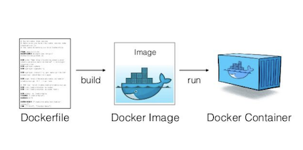
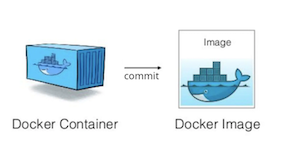
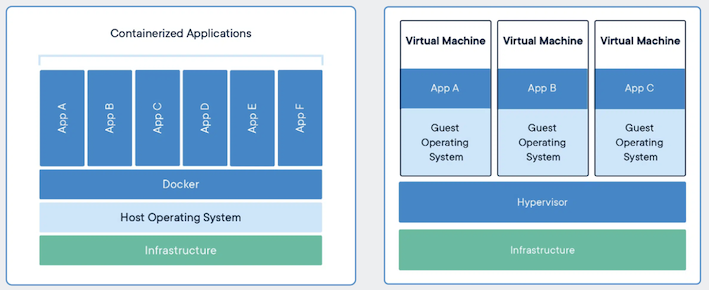

# What is Docker?
*If you are already familiar with Docker you may skip this step*

Docker is an open source software which allows for  applications to be build and deployed in isolated environments anywhere. It is the many features of a linux kernel Docker exploits like *namespaces* and *control groups*.

Dockerizing a project means one creates a Dockerfile in the root folder of a project. A Dockerfile is a text file which contains commands to assemble a docker image. A docker image is a snapshot of the current environment which is stored and can be shared with other for them to open the exact same enviornment on the same or another host. Many commonly used images can be found and retrieved from [Docker Hub](https://hub.docker.com/). 

A Docker container is an instance of an image. The container is in fact a self contained process meaning it has its own memory space and file system completely isolated from other containers or with the underlying system. A Docker container can be modified during runtime. However, in order for the changes to be saved a new image with the changes must be built, also refered to as commiting changes to a docker image.

  
## Docker versus VMs

Docker is usually compared with virtual machines (VMs).
However, unlike virtual machines the containers do not carry payload of an entire OS instance and hypervisor. They include only the necessary OS processes and dependencies necessary to execute the container code. In more specific terms it virtualises only the application layer, not the entire OS layer. 

  

## Why is Docker important in devops?
Docker comes with few feature important from a devops perspective.

- Greater use of resource: Since they require less space than VM they allow for many more copies of an application to be run on the same hardware than using VMs, which potentially reduces cloud spending. 

- Improves productivity: Compared to VMs they are also easier and faster to deploy and restart making them more ideal for in continuous integration and continuous delivery pipelines. The image-based deployment model Docker offers makes it easier to share an application or service across multiple environments. It also allows for containers to be reused and automate the creation of containers using application source code.

-  Improves productivity: Docker is important from a Devops perspective as it allows multiple applications and processes to share resources to make better use of the infrastructure yet keep them running seperatly retaining the security one would have using two seperate system. 

- Versioning: Docker allows for versions of container images to be tracked, which makes it easier to traceback if necessary.

Docker is preinstalled in the environment to the right. Run `docker`{{execute}} to check the man page.

To read about specific docker commands run `docker pull --help`{{execute}}

More information can be found at [Docker's website](https://www.docker.com/)

