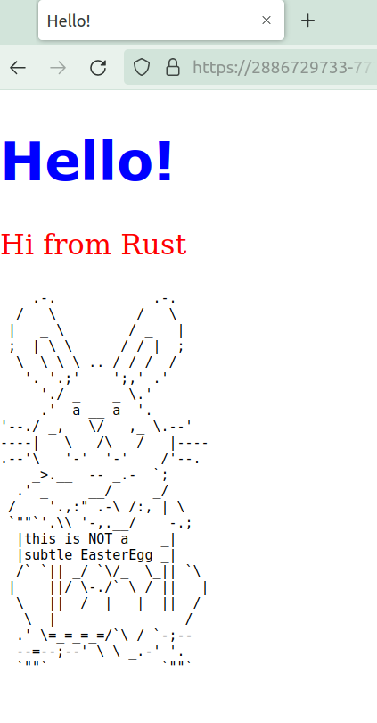

# Expose the rust server

## A first try

What about this port we created? We need to make it available from outside the container.

First stop the container running `docker stop rusty-server1`{{execute}}

If you run `docker ps -a`{{execute}}, the container should have been removed, thanks to the flag `--rm` as described in step 5.

Remember `7878` is the port we chose for the Rust server to listen to in the main function, as you can see in the code snippet below.

```rust fn main() {
    let listener = TcpListener::bind("127.0.0.1:7878").unwrap();

    for stream in listener.incoming() {
        let stream = stream.unwrap();

        handle_connection(stream);
    }
}
```

Now lets re-run the image but this time exposing the port. Lets choose port `7777`.

`docker run -d -it -p 7777:7878 --rm --name rusty-server1 rusty-server`{{execute}}

Now requests to 7777 will be redirected to 7878.

`docker ps -a` will show you the following:

```console
CONTAINER ID   IMAGE     COMMAND           CREATED          STATUS          PORTS                                       NAMES
5be3e4655dd5   servo     "server_devops"   31 seconds ago   Up 30 seconds   0.0.0.0:7777->7878/tcp, :::7777->7878/tcp   servo1
```


While the container is up and running you can access it on https://2887145477-7777-elsy04.environments.katacoda.com/, or can you?
<br/><br/>


## A second try
As the code snippet above shows the Rust server is listening on localhost. `127.0.0.1`, that is the container *own local host*. But the localhost of the container is not your localhost, therefore it is unreachable.

We are listening at an address that does not exist. 
<!-- Är du säker på att den inte existerar? Är det inte bara att den inte är nåbar? -->

Lets fix this!
- Go to folder `cd DD2482-executable-tutorial/server_devops/src/`{{execute}}
- Open the code in a text editor like `vim main.rs`{{execute}}
- Type `i`{{execute}} to enter insert mode and change the following line:
```rust
-let listener = TcpListener::bind("127.0.0.1:7878").unwrap();
```
to 
```rust
let listener = TcpListener::bind("0.0.0.0:7878").unwrap();
```
- To save the file press `esc` to escape the insert mode and `:wq`{{execute}} to save the changes.


The server will now listen to any computer, on port 7878.
Make sure the old server is not running, use `docker stop rusty-server1`{{execute}} to be sure you may also check what containers are running using `docker ps -a`{{execute}}

Now we have to rebuild the docker image to the latest changes.
`docker build . -t rusty-server`{{execute}}

Run the docker image to create a new container instance.
`docker run -d -it -p 7777:7878 --rm --name rusty-server1 rusty-server`{{execute}}


Go to `https://[[HOST_SUBDOMAIN]]-7777-[[KATACODA_HOST]].environments.katacoda.com/` and you should see:




