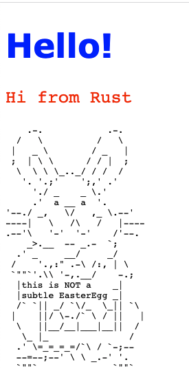

# Fix the Rust server to listen to the world
## A second try

The Rust server is listening on localhost. But the localhost of the Container is not your localhost.

What is happening is something like this the Rust server is on `127.0.0.1`, that is the container *own local host*. It is unreachable. Så bra med isolated environments.

We are listening at an address that does not exist.

To fix this, go to the Rust code and make the server listen on all possible connections with ` TcpListener::bind("0.0.0.0:7878")`.

`nano src/main.rs`{{execute}}

and change the line:

```git
-let listener = TcpListener::bind("127.0.0.1:7878").unwrap();
+let listener = TcpListener::bind("0.0.0.0:7878").unwrap();
```

Save the file (???)
The server will now listen to any computer, on port 7878.

Rebuild the file as per step# (link?)
`docker build . -t rusty-server`{{execute}}

Run the file as per step 4. 
`docker run -d -it -p 7777:7878 --rm --name rusty-server1 rusty-server`{{execute}}

If the old server is running, use `docker stop <Container name>`


Go to `localhost:7777` and you should see:




